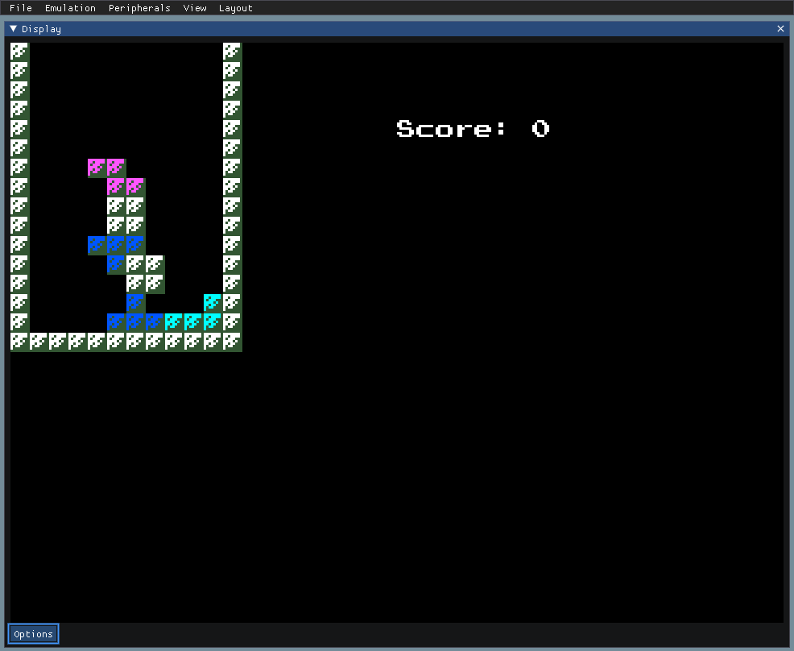
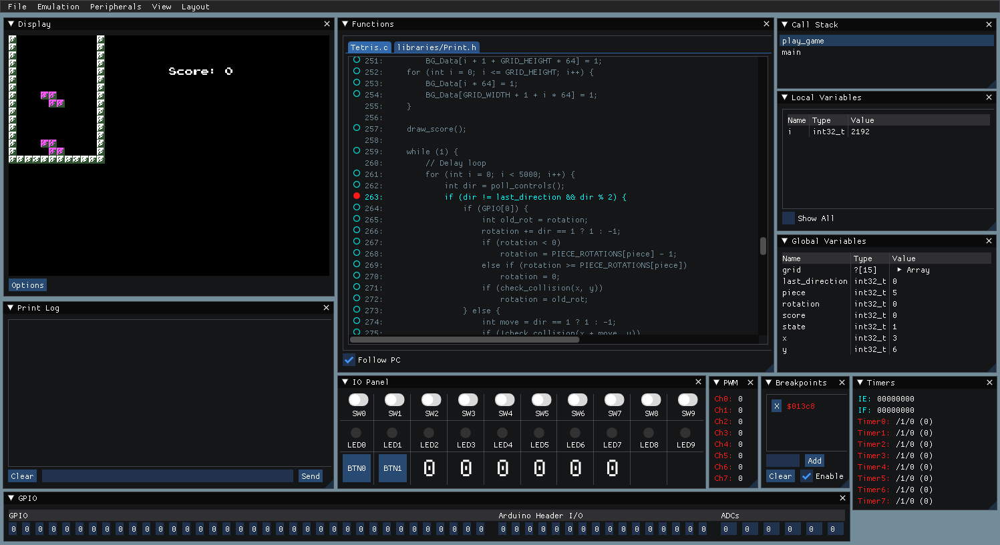
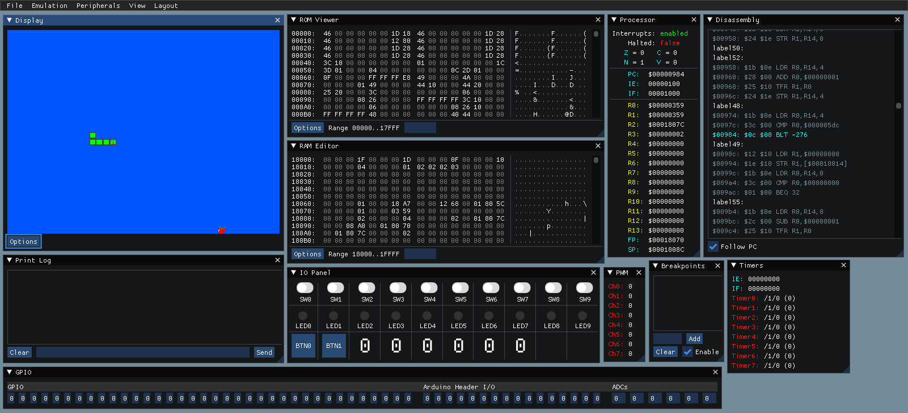
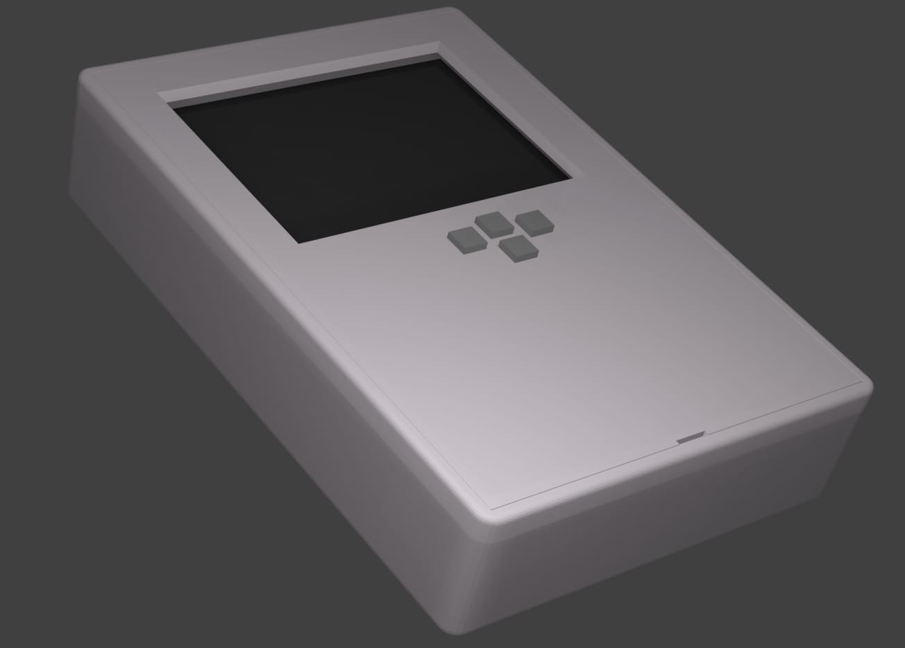
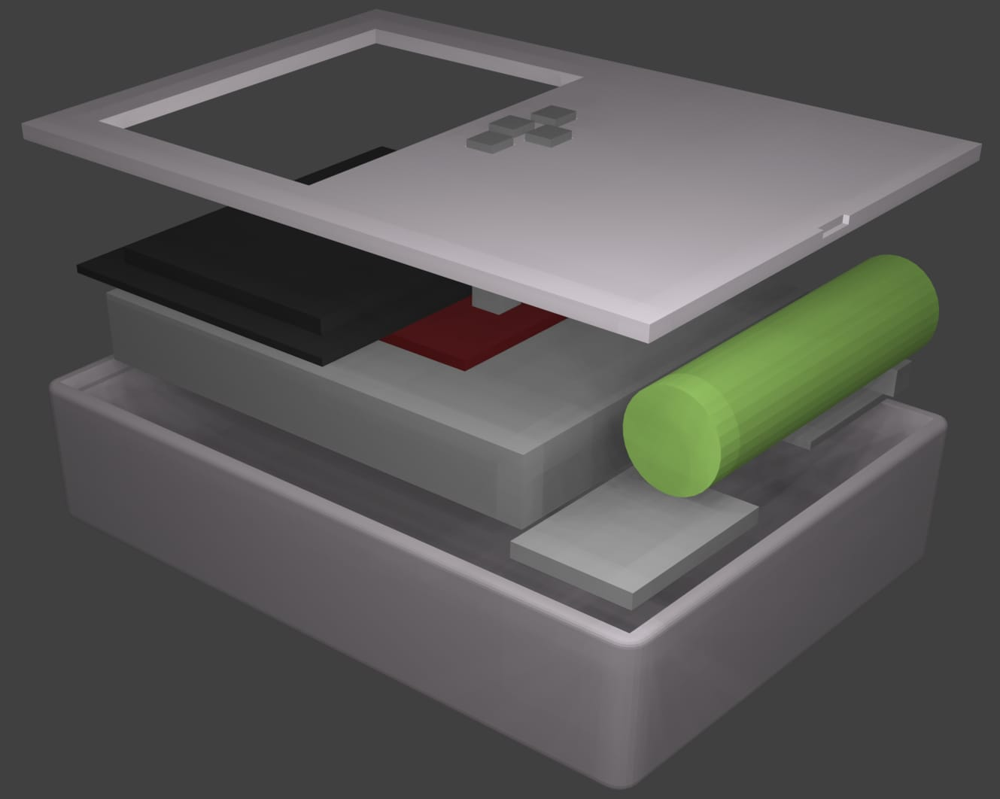

# VHDLSonic

## Web Demo
[Play bad Tetris and Snake, plus other demos in the emulator](https://thelogicmaster.github.io/VHDLSonic/)

## About
This project is a custom 32-bit CPU built into a soft-core microcontroller/retro game console designed
from the ground up. With support for three languages, a fully synthesizable computer based on a custom
architecture, an emulator/debugger, an IDE plugin, and a provided software library with utilities, 
examples and games, what more could you ask for? Well, given that we've moved a bit away from retro
computers, this project is really just a toy, but designing everything from scratch is the whole point.
It combines a console with the graphical fidelity of a cheap Game Boy knockoff with a basic 
microcontroller, and you get what I think is something amazing. Or maybe just mediocrity, who's to say?
It plays terrible Snake and Tetris, though, so that's worth something.

Maybe that doesn't quite get across the scope of the project, though. This project was built off of the 
back of my previous 8-bit computer design project, [LM-8](https://github.com/TheLogicMaster/lm8), with
portions being ported rather than designed from nothing. Three languages are supported for development
on the platform: Assembly, C, and Basic. The Assembler uses a custom syntax, but is nothing special,
just a basic Python script. The Basic support is more interesting, since it's compiled to assembly
rather than interpreted at runtime. The C compiler is a huge part of the project, though. It consists
of a custom backend for the retargetable VBCC compiler that produces compatible assembly. Reverse engineering 
the intermediate representation used by VBCC was a huge task, along with configuring the compiler for
this custom architecture, but it now serves as the most straightforward way to develop for the
platform. 

Of course, programming for the platform is only one side of the story. What about when you inevitably
need to spend hours debugging a single line of code? There's a solution for that, too; the emulator
doubles as a debugger. This debugger not only allows normal breakpoint debugging with debug symbols
for tracing back the machine code to the source assembly/C, but also allows inspecting the internals
of all the major components including the CPU, the GPU, the APU, and the various microcontroller
peripherals. It even extracts C global and local variables for ease of inspection, with custom
tooltips for showing pointer data like C strings. The debugger even integrates with the synthesized
computer running on FPGA hardware, providing most of the same features using the janky Altera
USB/JTAG interfaces.

What's a software platform without plenty of examples? Various example programs in the supported
languages are provided to do everything from implementing an RTOS to playing Tetris. Want to make
a Jukebox style program? There are two music player examples using the provided timer/APU based
chiptune player plus a script for generating song binaries. Want to load RLE compressed animations 
off of an SD card to play on an OLED screen? There are examples and libraries for SSD1306 and SD card
access. Pushing a tile based renderer to the limits? There's an example for using VBlank interrupts to
achieve Game Boy style sine wave graphical effects.

But what about the specs? We've got 96 KB for program ROM, 32 KB for program RAM, 16 32-bit general
purpose CPU register, 8 configurable interrupts, four different memory addressing modes, and a 
customizable data bus with memory mapped I/O peripherals. 
The APU has 4 square wave audio channels with configurable frequency, volume, and duration. The GPU is
a full-blown retro 8-bit tile renderer with 64 2x2 tile sprites, a scrollable 64x64 tile background
layer, a 40x30 tile movable window layer, 256 tiles, and a 16-color palette. This immense graphical 
fidelity is used to render bad Snake and Tetris clones on either the dev board's VGA output or an
ILI9341 based LCD, all at a staggering 320x240 pixel resolution. It also features standard
microcontroller features like timers, GPIO, PWM, ADCs, UART, plus software I2C/SPI.

There were many technical challenges associated with this project. For instance, just fighting with
the Altera build tools to get a CPU debug interface working over USB Blaster JTAG was quite a challenge,
involving lots of patching, TCL scripting, and trial and error. So much trial and error. When 
attempting to debug a program, the bugs could come from so many sources, since most of the
project is custom. Maybe the problem is in the Assembly program, or one of the Assembly libraries,
or maybe one of the compilers has a bug, or maybe the emulator itself or synthesized CPU has a bug. A
large portion of the project was debugging the C compiler output. While the documentation for
VBCC custom backend development isn't bad at all, it still leaves many unknowns as far as the edge
cases and requires delving deep into the nearly unreadable existing backends with so many optimizations
that the core functionality is obscured. Stepping through thousands of lines of generated assembly to
verify that the behavior matched the C code was very much the norm. 

The other main source of issues was with the GPU. In order to get the required memory throughput,
pipelining techniques, dual port memory, and render line buffering for sprites were needed. A scanline
style rendering method is used, making it compatible with both VGA and the LCD output while also
providing windows and interrupts for programs to access VRAM. Getting the timing requirements satisfied
for the memory and display drivers was a substantial challenge, along with the necessary abstraction
layer so support two completely different display drivers. Bandwidth was also an issue for the LCD,
since most breakout boards only expose a single data bit for SPI communication. In this case,
an 8-bit parallel interface was needed to get the required drawing speed. The largest challenge with
the FPGA development was compilation times, though. For a full compile of the computer, it could easily
take upwards of ten minutes. This adds up very quickly when you are testing various clock dividers and
other small tweaks to try to resolve rendering bugs. Compiled programs escape this recompilation time
by updating the ROM data directly.

## Documentation
- [Architecture](docs/Architecture.md)
- [User Manual](docs/UserManual.md)
- [APU](docs/APU.md)
- [GPU](docs/GPU.md)
- [Peripherals](docs/Peripherals.md)
- [BASIC](docs/Basic.md)
